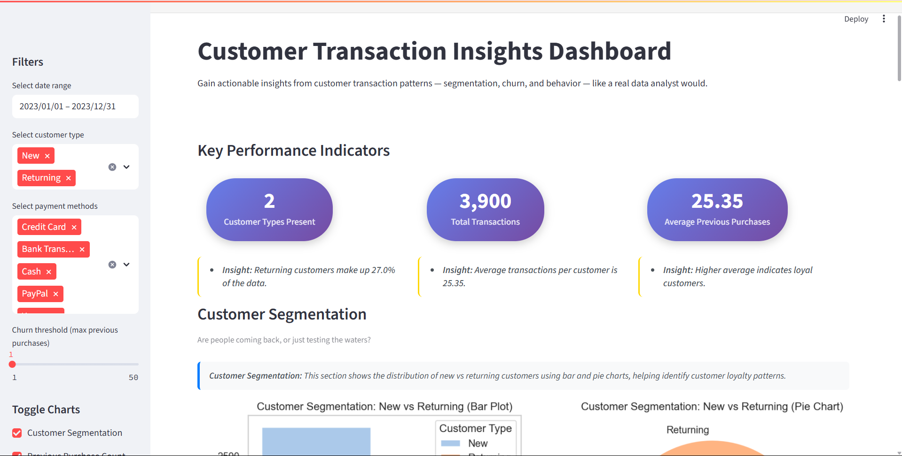

# 💳 Customer Transaction Insights Dashboard

An interactive end-to-end data analysis dashboard that simulates how a data analyst at **Customer** might extract meaningful business insights using Python and visual storytelling.

> Built with Streamlit, Seaborn, and Pandas — with easy Excel export for filtered insights.

🔗 **Live App**: [customer-insights-dashboard.streamlit.app](https://customer-insights-dashboard.streamlit.app/)  
📂 **Source Code**: [GitHub Repo](https://github.com/siddhiphatkare/Customer_Transaction_Insights_Dashboard)

---

## 📚 Table of Contents

- [🚀 Quick Start](#-quick-start)
- [📌 Objective](#-objective)
- [📸 Dashboard Preview](#-dashboard-preview)
- [🚀 Features](#-features)
- [🛠️ System Requirements](#️-system-requirements)
- [⚙️ Installation](#️-installation)
- [📊 Dataset Information](#-dataset-information)
- [🧩 Usage Guide](#-usage-guide)
- [📐 System Design](#-system-design)
- [🏗️ Project Structure](#-project-structure)
- [🔧 Customization & Scalability](#-customization--scalability)
- [🧠 Ideal Use Cases](#-ideal-use-cases)
- [🔍 Troubleshooting](#-troubleshooting)
- [🏅 Badges](#-badges)
- [✨ Author](#-author)
- [🙌 Support & Connect](#-support--connect)
- [🤝 Contributing](#-contributing)

---

## 🚀 Quick Start

### Option 1: Direct Streamlit Dashboard (Recommended)
```bash
# Clone and run in 3 simple steps
git clone https://github.com/siddhiphatkare/Customer_Transaction_Insights_Dashboard.git
cd Customer_Transaction_Insights_Dashboard
pip install streamlit pandas seaborn plotly
streamlit run streamlit_app.py
```

### Option 2: Jupyter Notebook Analysis
```bash
# For detailed analysis and experimentation
jupyter notebook Customer_Transaction_Insights_Dashboard.ipynb
```

🎯 **Ready to explore?** Open your browser to `http://localhost:8501`

---

## 📌 Objective

Simulate how a data analyst would extract insights from transaction data for segmentation, churn, frequency, and payment behavior analysis using Python and Streamlit. This dashboard transforms raw transaction data into actionable business intelligence through interactive visualizations and automated reporting.

---

## 📸 Dashboard Preview

### Main Dashboard

<sub><p align="center">Capsule KPIs • Real-time filters • Multi-chart layout</p></sub>


> 💡 *The KPI insights are now more readable, aligned, and easier to interpret with real-time filtering capabilities.*

---

## 🚀 Features

📊 **Analytics** | ⏱️ **Time Intelligence** | 💳 **Payment Analysis**  
👥 **Churn Prediction** | 📈 **KPI Monitoring** | 📥 **Export Tools**  

### Core Analytics
- **Customer Segmentation**: New vs Returning customer analysis
- **Transaction Frequency**: Purchase pattern identification
- **Payment Method Preferences**: Payment behavior insights
- **Churn Analysis**: Configurable purchase threshold detection
- **Time-based Trends**: Monthly and weekday pattern analysis

### Interactive Features
- **Real-time Filtering**: Date range, customer type, payment method
- **Dynamic KPIs**: Capsule-style metrics with aligned insights
- **Export Capabilities**: Download filtered datasets as Excel reports
- **Responsive Design**: Works on desktop and mobile browsers

### Advanced Capabilities
- **Predictive Insights**: Churn probability scoring
- **Cohort Analysis**: Customer lifecycle tracking
- **Revenue Attribution**: Channel performance analysis

---

## 🧰 Built With

This project uses the following tech stack:

- [](https://www.python.org/)
- [](https://pandas.pydata.org/)
- [](https://seaborn.pydata.org/)
- [](https://plotly.com/)
- [](https://streamlit.io/)
- [](https://jupyter.org/)


> 📊 Built with love and Python for real-time customer insights.

---

## 🛠️ System Requirements

### Minimum Requirements (Streamlit Dashboard)

- **Python**: 3.8 or higher  
- **RAM**: 2GB minimum (sufficient for Streamlit)  
- **Storage**: 200MB free space  
- **Browser**: Chrome 90+, Firefox 88+, Safari 14+, Edge 90+  

### Additional Requirements (Jupyter Notebook)

- **Jupyter**: Latest version  
- **RAM**: 4GB recommended for full analysis  
- **Storage**: 500MB free space  

### Supported Platforms

- ✅ Windows 10/11  
- ✅ macOS 10.15+  
- ✅ Ubuntu 18.04+  
- ✅ Docker containers  

---

## ⚙️ Installation

### Option 1: Streamlit Dashboard Only (Lightweight)
```bash
# 1. Clone the repository
git clone https://github.com/siddhiphatkare/Customer_Transaction_Insights_Dashboard.git
cd Customer_Transaction_Insights_Dashboard

# 2. Install minimal dependencies
pip install streamlit pandas seaborn plotly

# 3. Launch the dashboard
streamlit run streamlit_app.py
```

### Option 2: Complete Installation (Dashboard + Notebook)
```bash
# 1. Clone the repository
git clone https://github.com/siddhiphatkare/Customer_Transaction_Insights_Dashboard.git
cd Customer_Transaction_Insights_Dashboard

# 2. Create virtual environment (recommended)
python -m venv venv
source venv/bin/activate  # Linux/Mac
# or
venv\Scripts\activate  # Windows

# 3. Install all dependencies
pip install -r requirements.txt

# 4. Launch options:
streamlit run streamlit_app.py           # For dashboard
jupyter notebook                         # For notebook analysis
```

### Option 3: One-Click Deploy
[](https://share.streamlit.io/siddhiphatkare/customer_transaction_insights_dashboard/main/streamlit_app.py)

---

## 📊 Dataset Information

### Data Source
Original dataset sourced from: [Shopping Trends Dataset - Kaggle](https://www.kaggle.com/code/ahmedemadmorad/shopping-trends)

### Dataset Modifications
- Added Column: purchase_date - Manually generated for time-based trend analysis
- Enhanced Features: Additional derived columns for churn analysis

### Sample Data Schema
```python
# Expected CSV structure
columns = {
    'customer_id': 'string',                    
    'age': 'int',                               
    'gender': 'string',                         
    'item_purchased': 'string',                
    'category': 'string',                      
    'purchase_amount_(usd)': 'float',           
    'location': 'string',                      
    'size': 'string',                           
    'color': 'string',                          
    'season': 'string',                        
    'review_rating': 'float',                   
    'subscription_status': 'string',            
    'payment_method': 'string',                 
    'shipping_type': 'string',                 
    'discount_applied': 'string',               
    'promo_code_used': 'string',                
    'previous_purchases': 'int',               
    'preferred_payment_method': 'string',       
    'frequency_of_purchases': 'string',         
    'purchase_date': 'date'  # *Manually added for time-based analysis*
                 
}

```

### Data Requirements
- **Format**: CSV files with headers
- **Size**: Up to 100MB (10M+ rows supported)
- **Encoding**: UTF-8 recommended
- **Date Format**: YYYY-MM-DD or MM/DD/YYYY

---

## 🧩 Usage Guide

### Getting Started
- Streamlit Dashboard
  - Access Dashboard: Visit the live app or run locally
  - Load Data: Pre-loaded sample transaction data included
  - Configure Filters: Sidebar for date ranges, types, methods
  - Adjust Settings: Churn threshold slider available
  - Explore Insights: KPIs, charts, and analytics
  - Export Results: Excel reports from filtered view

- Jupyter Notebook
  - Open Notebook: Customer_Transaction_Insights_Dashboard.ipynb
  - Run Analysis: Execute cells for detailed exploration
  - Customize: Modify analysis parameters and visualizations
  - Export: Save results and charts for reporting

---

## 📐 System Design

```
┌─────────────────┐    ┌──────────────────┐    ┌─────────────────┐
│   Data Layer    │    │  Processing      │    │   Presentation  │
│                 │    │                  │    │                 │
│ • CSV Files     │───>| • Pandas ETL     │───>│ • Streamlit UI  │
│ • Sample Data   │    │ • Data Cleaning  │    │ • Plotly Charts │
│ • Local Storage │    │ • Feature Eng.   │    │ • Export Tools  │
└─────────────────┘    └──────────────────┘    └─────────────────┘
```

---
## 🏗️ Project Structure

```

Customer_Transaction_Insights_Dashboard/
├── streamlit_app.py                               # Main dashboard application
├── Customer_Transaction_Insights_Dashboard.ipynb  # Detailed analysis notebook
├── requirements.txt                               # Python dependencies
├── shopping_trends.csv                            # Sample dataset
├── utils.py                                       # Utility functions
├── images/                                        # Dashboard screenshot
│    dashboard_preview.png
├── README.md                                      # This file
└── LICENSE                                        # MIT License

```
---
## 🔧 Customization & Scalability

```python
# config.py - Customize business rules
CHURN_THRESHOLD_DAYS = 30
KPI_REFRESH_INTERVAL = 60
DEFAULT_CHART_THEME = 'plotly_white'
```

---

## 🧠 Ideal Use Cases

- E-commerce Platforms: Track customer retention
- SaaS Companies: Monitor churn and upgrades
- Retail Analytics: Seasonal trend analysis
- Financial Services: Transaction behavior patterns

---

## 🔍 Troubleshooting

### Installation Problems
- Ensure Python 3.8+ is installed
- For minimal setup: Run  `pip install streamlit pandas seaborn plotly`
- For complete setup: Run `pip install --upgrade -r requirements.txt`


### Data Errors
- Check CSV encoding: `utf-8-sig`
- Parse dates explicitly if needed

### Performance Issues
- Use Streamlit-only setup for faster performance
- Optimize large datasets
- Use modern browsers for best performance

---

## ✨ Author

**Built by [Siddhi Phatkare](https://www.linkedin.com/in/siddhi-phatkare-a78552250/)**  
<br>

[](https://www.linkedin.com/in/siddhi-phatkare-a78552250/)
&nbsp;
[](https://github.com/siddhiphatkare)

<br>

Licensed under the [MIT License](LICENSE).  
Open for learning & inspiration — not for rehosting or resale.

---

## 🏅 Badges

[](https://streamlit.io/)  
[](LICENSE)  
[](https://github.com/siddhiphatkare/Customer_Transaction_Insights_Dashboard/stargazers)
[](https://stats.uptimerobot.com/CcMCwisBuV)

---

> 📊 A Python + Streamlit dashboard for customer segmentation, churn analysis, and time-based insights.  
> View clean capsule KPIs, filter live data, and export Excel reports — all in one click.

---

## 🙌 Support & Connect

If you found this project useful, insightful, or inspiring:  
⭐ Give it a star on GitHub — it helps others discover it and shows your support!  
Fork it, build on top of it, or reach out to collaborate.

📬 Let's connect on [LinkedIn](https://www.linkedin.com/in/siddhi-phatkare-a78552250/)!

🐞 Found a bug or want to request a feature? [Open an issue here](https://github.com/siddhiphatkare/Customer_Transaction_Insights_Dashboard/issues)

---

Made with ❤️ by [Siddhi Phatkare](https://www.linkedin.com/in/siddhi-phatkare-a78552250/)  
📊 Empowering data-driven storytelling, one dashboard at a time.

---

> **Tags**: Customer Transaction Dashboard, Streamlit Portfolio Project, Python Data Analysis, E-commerce Churn Analysis, Excel Export Tool, Real-time Insights

