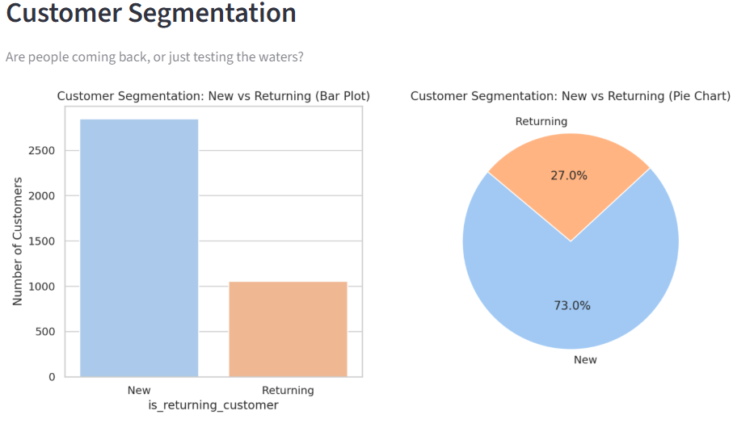
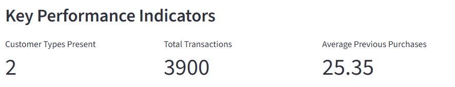
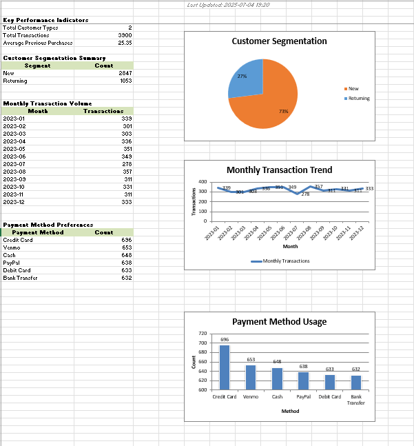

# 💳 Customer Transaction Insights Dashboard

An interactive end-to-end data analysis dashboard to uncover customer behavior, transaction patterns, and generate actionable business insights using a PayPal-like dataset.

🔗 **Live App**: [customer-insights-dashboard.streamlit.app](https://customer-insights-dashboard.streamlit.app/)  
📂 **Source Code**: [GitHub Repo](https://github.com/siddhiphatkare/Customer_Transaction_Insights_Dashboard)

---

## 📌 Objective

This project helps answer key business questions like:
- Who are the high-value customers?
- What time periods see the most transactions?
- Which payment methods are most preferred?
- Are we retaining or losing customers?

---

## 🔧 Tech Stack

- **Python 3.9+**
- **Pandas, NumPy** — Data manipulation
- **Matplotlib, Seaborn** — EDA & visualizations
- **Streamlit** — Interactive web dashboard
- **XlsxWriter** — Excel report generation (with KPIs, charts & formatting)

---

## 🗂️ Project Structure

| File | Description |
|------|-------------|
| `Customer_Transaction_Insights_Dashboard.ipynb` | Notebook with full EDA and insight generation |
| `streamlit_app.py` | Streamlit frontend with interactive dashboard and Excel export |
| `shopping_trends.csv` | Dataset used for analysis |
| `README.md` | Project documentation |
| `requirements.txt` | Python package dependencies |

---

## 📸 Screenshots

### 🔹 Dashboard Overview

<p align="center">
  
  
  
</p>

<p align="center">
  <em>Left: Customer Segmentation · Center: KPI Metrics · Right: Time-Based Trends</em>
</p>

---

### 🔹 Excel Report Example

<p align="center">
  
</p>

<p align="center">
  <em>Excel Summary Sheet: KPIs · Timestamp · Segmentation · Charts</em>
</p>

---

## ▶️ How to Run Locally

```bash
git clone https://github.com/siddhiphatkare/Customer_Transaction_Insights_Dashboard.git
cd Customer_Transaction_Insights_Dashboard
pip install -r requirements.txt
streamlit run streamlit_app.py
```

Or open the Jupyter Notebook via:

```bash
jupyter notebook Customer_Transaction_Insights_Dashboard.ipynb
```

---

## 🧠 Skills Demonstrated

- Exploratory data analysis (EDA)  
- Data storytelling & business thinking  
- Python data pipelines  
- Interactive dashboard building  
- Streamlit app development  
- Excel automation with formatting, KPIs, and dynamic charts
- Business insight generation through customer segmentation, churn analysis, and payment trends

---

## 📊 Key Business Insights

> 🔹 **60%+ of transactions** come from **returning customers** — loyalty programs can help improve retention even further  
> 🔹 **Most purchases occur between 6–9 PM**, indicating this is a high-engagement window for targeted promotions  
> 🔹 **Credit Card** is the most popular payment method — potential for card-based offers or partnerships  
> 🔹 **Customers with fewer than 2 past purchases** represent a churn risk — re-engagement strategies needed  
> 🔹 **New customers dominate transaction volume**, but returning customers contribute more consistently over time

---

## 🔮 Future Improvements

- Add clustering for automatic segmentation (KMeans or RFM)
- Include predictive churn modeling
- Export PDF reports or schedule auto-emails
- Optional: Power BI version for business-side stakeholders

---

## 🙋‍♀️ About Me

Siddhi Phatkare  
📫 [LinkedIn](https://www.linkedin.com/in/siddhi-phatkare-a78552250/)
<!-- 🗂️ [My Resume](https://your-resume-link.com) -->


---

## 🤝 Contributions

Got ideas or want to improve this project? Fork the repo and open a PR! Contributions are welcome.

---

> © 2025 Siddhi Phatkare.  
> Feel free to explore, learn from, or fork this project — just avoid deploying it as-is under your name.
